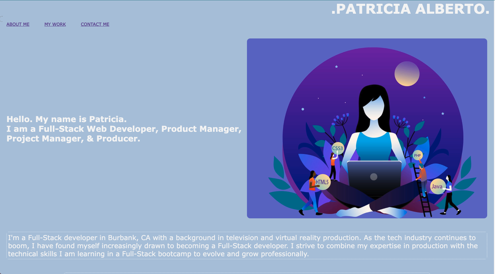
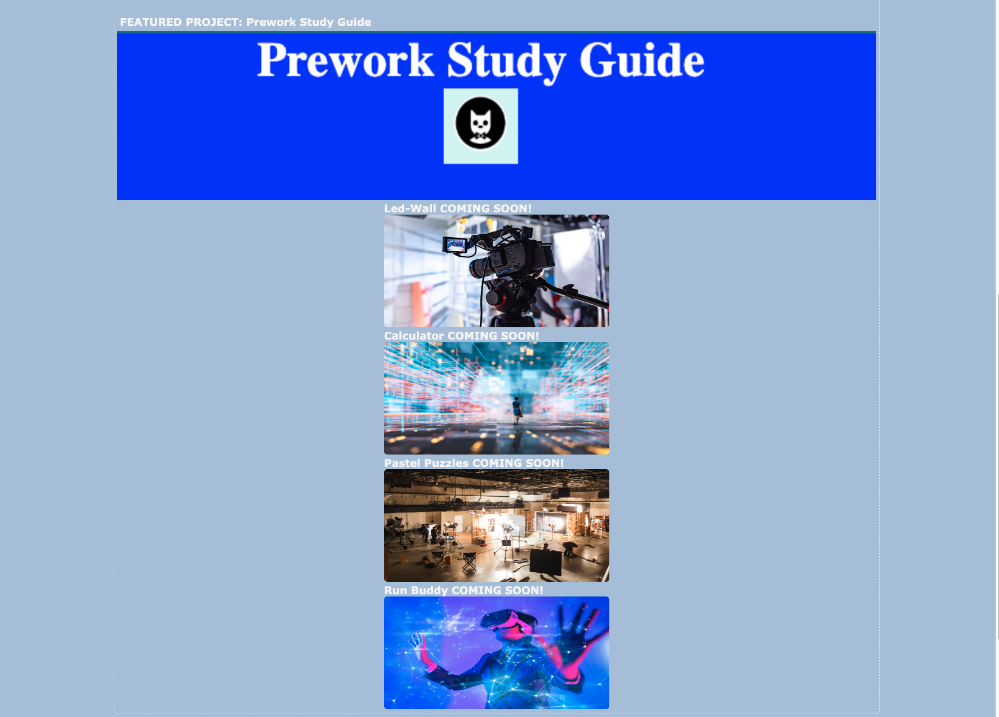
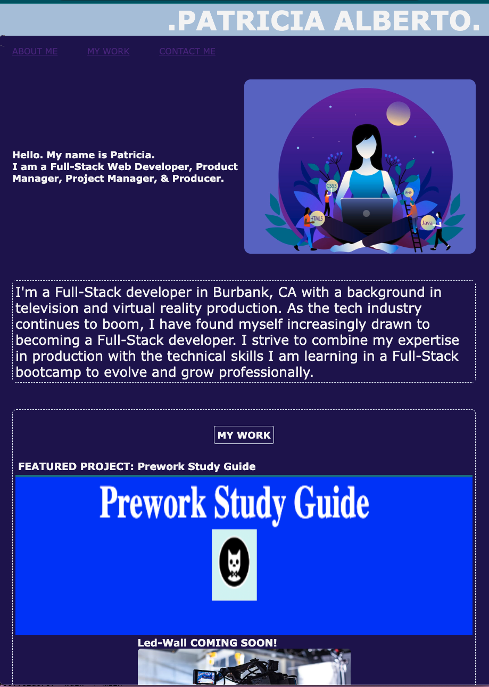

# Challenge2-ProfessionalPortfolio

## Description

My motivation for this proejct was to build a portfolio showcasing my work as a budding web developer and tie in my background from media production, as this page reflects.  In this professional portfolio, I would like to put my greatest works on display for future employers, once I complete these works and the UCLA Full-Stack Coding Bootcamp.  Each section will link to a deployed project.  This solves the problem of not having a central repository to display my work as I apply my new skills in web development to creating web projects.  Throughout this project, I have learned to build a website from scratch using HTML and CSS.  I have applied the style tools in CSS such as flexboxes and media queries.  

Link Deployed website: 

## Installation
N/A

## Usage

At the top of this website there is a navigation bar with links that, when clicked, will scroll down to its corresponding section.  Links to the section of "my work" will take you to the title images of my current works.  Stock images serve as placeholders for future works that will be added.   When you hover over the image a transition has been applied so the user can see that the specific work is selected. Projects listed "COMING SOON!" will currently link to google.com.   Once clicked on, a new tab will pop up taking them to the deployed project's website.  Although, this webpage is meant for desktop viewing media queries have been applied to respond to the viewports of a desktop, tablet, and mobile.  This allows the user to view this website at the various screen sizes. To indicate when the screen size hits a max with for tablet and mobile, the background color changes to a darker purple.  

   
   
   
   
   

## Credits

Stock images were pulled from various websites proided by links below: 

https://www.colum.edu/academics/creative-and-media-spaces/media-production-center

https://dribbble.com/shots/16563890-Women-Web-Developer-illustrator

https://www.adlib-recruitment.co.uk/blog/life-as-a-woman-in-web-development/

https://www.istockphoto.com/photos/virtual-reality

https://www.istockphoto.com/photos/virtual-reality

## License
N/A

## Features
N/A